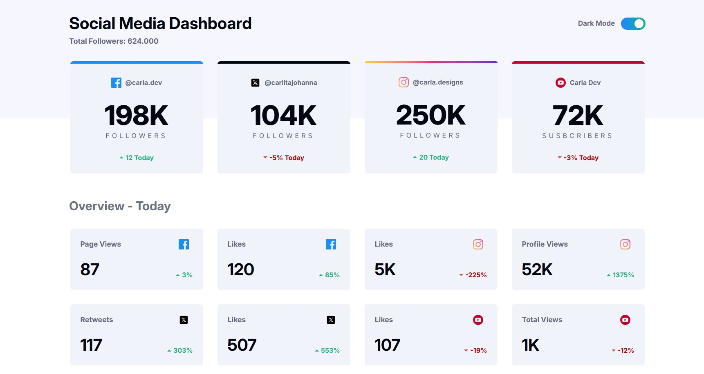

# Frontend Mentor - Social media dashboard with theme switcher solution

This is a solution to the [Social media dashboard with theme switcher challenge on Frontend Mentor](https://www.frontendmentor.io/challenges/social-media-dashboard-with-theme-switcher-6oY8ozp_H). Frontend Mentor challenges help you improve your coding skills by building realistic projects. 

## Table of contents

- [Overview](#overview)
  - [The challenge](#the-challenge)
  - [Screenshot](#screenshot)
  - [Links](#links)
- [My process](#my-process)
  - [Built with](#built-with)
  - [What I learned](#what-i-learned)
  - [Continued development](#continued-development)
  - [Useful resources](#useful-resources)
- [Author](#author)
- [Acknowledgments](#acknowledgments)

## Overview

### The challenge

Users should be able to:

- View the optimal layout for the site depending on their device's screen size
- See hover states for all interactive elements on the page
- Toggle color theme to their preference


### Screenshot

<p align="center">
  
  &nbsp;&nbsp;&nbsp;&nbsp;&nbsp;&nbsp;
  
  &nbsp;&nbsp;&nbsp;&nbsp;&nbsp;&nbsp;
  
  &nbsp;&nbsp;&nbsp;&nbsp;&nbsp;&nbsp;
  
</p>

## Authorsi, completemos las

- Website - [Carla Johanna](https://github.com/devcjoha)
- Frontend Mentor - [@devcjoha](https://www.frontendmentor.io/profile/devcjoha)
- X - [@CarlitaJohanna](https://www.x.com/carlitajohana)


## 🚀 Live Deploys

- Solution URL: [code](https://github.com/devcjoha/dashboard-social-media)
- Live Site URL: [Deploy-Github-Pages](https://devcjoha.github.io/dashboard-social-media/)


## My process

### Built with

<p align="center">

 &nbsp;&nbsp;&nbsp;&nbsp;&nbsp;&nbsp;

 &nbsp;&nbsp;&nbsp;&nbsp;&nbsp;&nbsp;

 &nbsp;&nbsp;&nbsp;&nbsp;&nbsp;&nbsp;

 &nbsp;&nbsp;&nbsp;&nbsp;&nbsp;&nbsp;

 &nbsp;&nbsp;&nbsp;&nbsp;&nbsp;&nbsp;

 &nbsp;&nbsp;&nbsp;&nbsp;&nbsp;&nbsp;

</p>

- React (component-based architecture).
- Vite (development and packaging).
- Functional components and hooks (useState, useEffect).
- Tailwind custom propertie, theme dark/light.
- Responsive design.


### 👩🏻‍🦱 What I learned
* Use useEffect to calculate dynamic metrics like total followers, avoiding unnecessary loops.
* Apply .toLocaleString() and custom functions like formatValue() to display numbers with thousands separators or suffixes (K).
* Encapsulate logic in reusable components (CardSocialMedia, CardOverviews, ModeToggle) and pass props clearly.
* Implement an accessible toggle with peer, appearance-none, and ```translate-x``` to animate the state change.
* Use ```bg-gradient-to-r``` and ```p-[2px]``` to simulate gradient borders, especially on the Instagram card.
* Resolve alignment issues with items-center, self-end, and leading-none to achieve a clean and consistent layout.
* Configure routes and assets correctly for GitHub Pages using ```import.meta.env.BASE_URL```.


### 💥 Continued development
* Encapsulate the cards as semantic components (MetricCard, PlatformCard) with platform-specific variations.
* Add smooth animations when switching modes (transition, ease-in/out) and when loading metrics.
* Validate accessibility using tools like Lighthouse and improve contrast in dark mode.
* Create a design system with documented tokens for colors, sizes, and spacing.
* Prepare a starter kit with this system for future projects, including a basic layout, toggles, and asset management.
* Explore how to integrate real data from a mock or external API to make the dashboard dynamic.

### 🔗 Useful resources
* Tailwind docs
* GitHub Pages deployment guides
* Vite + React integration tips

## 🚀 Deployment & Environment Setup

### 🧪 Entornos

- **Local**: Use `/` as the base for routes.

- **Production (GitHub Pages)**: Use `/` as the base.

### ⚙️ Scripts disponibles

```bash
# Ejecuta el proyecto en desarrollo local
npm run dev

# Build estándar (no recomendado para GitHub Pages)
npm run build

# Build para GitHub Pages (usa base name correcto)
npm run build:gh

# Vista previa del build
npm run preview
```

### 🧠 Why this configuration?

## Asset Handling for GitHub Pages
* To ensure logos and images load correctly in production:
* All SVG logos are stored in public/assets/.
* Each extension in data.json uses only the filename for its logo, like "logo-devlens.svg".
* In the hook, image paths are constructed using:

```js
logo: `${import.meta.env.BASE_URL}assets/${item.logo}`;
```
This ensures compatibility with GitHub Pages, which serves your app from a subpath like /browser-extension-manager-ui/. Using import.meta.env.BASE_URL dynamically adjusts the asset path based on the deployment environment.


## Author

- Website - [Carla Johanna](https://github.com/devcjoha)
- Frontend Mentor - [@devcjoha](https://www.frontendmentor.io/profile/devcjoha)
- X - [@CarlitaJohanna](https://www.x.com/carlitajohana)
